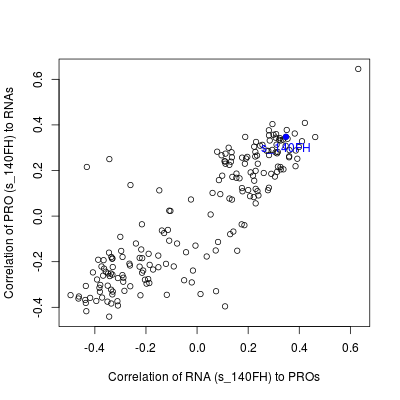

# COSMO


COSMO (COrrection of Sample Mislabeling by Omics) is an R package in detecting and identifying multi-omics sample mislabeling.

## Table of contents
* [Input Requirement](#input_requirement)
* [Preprocessing](#preprocessing)
  * [Chromosome annotation](#chr_annotation)
  * [Data cleaning](#data_cleaning)
* [Pairwise Alignment](#omics_alignment)
* [Clinical Attribute Prediction](#prediction)
  * [Partition sex chromosomes genes](#partition_sex)
  * [Predict sex](#predict_sex)
* [Label Correction](#label_correction)
  * [Generate table with corrected label](#corrected_table)
  * [Visualize mislabeled samples](#visualize_error)
* [Citing COSMO](#cosmo_cite)


# <a name="input_requirement"></a>Input Requirement
Three types of data are requirement for performing COSMO: RNAseq data, Proteomics data and Clinical data. Example inputs of RNAseq and Proteomics data matrix are shown below. The rows represent genes while columns represent samples.

```
> head(raw_rnaseq)
     Sample_1 Sample_2 Sample_3 Sample_4 Sample_5 Sample_6 Sample_7 Sample_8 Sample_9 Sample_10
AQP7    0.679   -1.058   -0.365    1.154    0.407   -0.538    1.945    1.081    0.019    -1.058
AQP8    0.407    1.104   -0.229    0.508    0.834    0.351    2.156    0.297   -0.630    -0.568
AQP9   -2.039    0.763    0.032   -0.646   -1.734   -0.324   -1.321   -0.124    1.457     1.013
AQR     0.464   -0.464    0.032    2.313    0.746    2.156   -1.035   -0.910    0.853    -0.421
AR      0.229    1.129    0.508   -1.537    0.493   -0.019   -0.479   -1.457    1.537    -0.695
ARAF    0.780   -1.013    0.032    0.111    0.269   -0.365    1.353   -0.071    0.728     1.233
```
```
> head(raw_proteome)
       Sample_1  Sample_2  Sample_3  Sample_4  Sample_5  Sample_6 Sample_7  Sample_8  Sample_9 Sample_10
GNAI3 11.844838  8.015803  9.052129 10.882482 12.677051  9.370279 7.116067  9.377593  9.682479 11.518119
APOH   7.025871 12.276211 11.964092 12.673845 10.429279  7.832973 7.841262 13.887502 10.763878  5.877140
COX5A 10.410051  8.940971 11.450089 11.103634  8.661922 10.539238 8.955594  9.730015  9.941418 10.440399
NGFR         NA        NA        NA        NA        NA        NA       NA        NA        NA        NA
FER   10.266363 10.602989 10.235408  8.978354 10.149195 10.104802 9.080098  9.059886 11.018418 10.428839
ACTR2 10.052418  9.110208 10.046786  9.379187 10.609200  9.543336 9.857091 11.199192 10.163634  9.309131
```


The example input of Clinical data is as below. The column `sample` is the unique names of the samples which corresponding with the column names of omics data matrix. The column `gender` is the sex of individual which the samples belong to.
```
> head(clinical)
    sample gender
1 Sample_1      F
2 Sample_2      F
3 Sample_3      F
4 Sample_4      F
5 Sample_5      F
6 Sample_6      F
```

# <a name="preprocessing"></a>Preprocessing
The preprocessing steps consist of chromosome annotation for genes, data cleaning and handling missing values. 

### <a name="chr_annotation"></a>Chromosome annotation
The genes are annotated with chromosome information. Sex chromosomes (X & Y) genes are handled different for missing value and are used to predict gender of omics data.
```
Usage: prpc_annotate(omics_data_1, omics_data_2)
Arguments:
    - omics_data_1: First omics data matrix, rows indicate genes while columns indicate samples
    - omics_data_2: Second omics data matrix, rows indicate genes while columns indicate samples

Example:
> chr_annotate <- prpc_annotate(raw_rnaseq, raw_proteome)
> head(chr_annotate)
  hgnc_symbol chromosome_name
1        A1BG              19
2        A1CF              10
3         A2M              12
4     A3GALT2               1
5      A4GALT              22
6       A4GNT               3
```
### <a name="data_cleaning"></a>Data cleaning
The genes with no variance or genes which have missing values in more than 50% of samples are removed. The remaining missing values are either removed or imputed based on user configuration.
```
Usage: prpc_omics(omics_data, chromosome_annotation, impute_missing = F)
Arguments:
    - omics_data: Omics data matrix, rows indicate genes while columns indicate samples
    - chromosome_annotation: Chromosome annotation of genes, obtained by prpc_annotate()
    - impute_missing: logical values. If TRUE, missing values will be imputed using Random-Forest based imputation method. FALSE by default.

Example:
> rnaseq <- prpc_omics(raw_rnaseq, chr_annotate, impute_missing = F)
> head(rnaseq)
       Sample_1 Sample_2 Sample_3 Sample_4 Sample_5 Sample_6 Sample_7 Sample_8 Sample_9 Sample_10
AFF1      0.853   -0.216    1.734    0.124    0.393   -1.496   -0.150    2.156    0.435    -0.045
AFF3      1.321   -0.695   -0.256   -0.324    0.780   -0.243    0.085   -0.019   -1.233    -0.058
AFF4     -0.910   -0.712    1.353    0.523   -1.290   -0.379   -0.746    0.479   -1.058    -1.496
AFG3L1    0.646    1.865    0.407    0.834   -1.058   -0.746   -0.971    1.945    0.493     0.393
AFG3L2    0.450   -0.071   -0.872    0.176   -1.865   -0.283    0.746    1.104    0.464    -0.435
AFM       0.045    0.615   -0.798   -0.568   -0.393    1.496   -0.712   -2.039    0.508     0.216
```

# <a name="omics_alignment"></a>Pairwise Alignment
Two omics data will be paired using Pearson correlation. Gene's Pearson correlation is calculated and highly correlated genes (R > cutoff) are extracted. The extracted genes are used to calculate Sample pairwise correlation before performing Stable Matching on the samples. This step is performed in two iterations and the results of the second iteration is used for downstream steps.

```
Usage: align_omics(omics_data_1, omics_data_2, cutoff = 0.5)
Arguments:
    - omics_data_1: First omics data matrix, rows indicate genes while columns indicate samples
    - omics_data_2: Second omics data matrix, rows indicate genes while columns indicate samples
    - cutoff: Cutoff used to extract highly correlated genes (Pearson correlation > cuttoff). By default is 0.5.

Example:
> align_outputs <- align_omics(rnaseq, proteome, cutoff = 0.5)
> names(align_outputs)
[1] "geneCor_1"     "geneCorPlot_1" "sampleCor_1"   "matching_1"    "geneCor_2"     "geneCorPlot_2" "sampleCor_2"   "matching_2"

  # There are four types of outputs: geneCor, geneCorPlot, sampleCor, matching
  # Details of output are explained below
  # The suffix '_1' and '_2' indicates the results from first and second iteration respectively
```

The output of function `align_omics` contains:
<details>
  <summary>Gene Correlation Table</summary>

  ```
> head(align_outputs$geneCor_2)
        Pearson_cor
AS3MT     0.9025764
FADS1     0.8977678
UGT3A2    0.8977200
C8B       0.8951626
SLCO1A1   0.8925102
DDAH1     0.8917837
  ```
</details>

<details>
  <summary>Gene Correlation Histogram</summary>

  ```
> align_outputs$geneCorPlot_2
  ```
  
</details>

<details>
  <summary>Sample Correlation Matrix</summary>

  ```
> align_outputs$sampleCor_2
               Sample_1    Sample_2    Sample_3    Sample_4   Sample_5     Sample_6    Sample_7    Sample_8    Sample_9   Sample_10
Sample_1  0.575805020  0.14256837 -0.31723942 -0.12712153  0.3617813 -0.009961435  0.38950457 -0.42160385  0.30915487 -0.20602113
Sample_2  0.116860993  0.66203921 -0.09165578 -0.27854116  0.1325401  0.124632433  0.03917587 -0.33481149  0.14407378 -0.06390501
Sample_3 -0.298571686 -0.09381293  0.59467835 -0.09447846 -0.3386942 -0.006117835 -0.36994621  0.23718847 -0.28004772  0.29070644
Sample_4 -0.003344968 -0.34672622 -0.19905244  0.74567959  0.1076100 -0.209231200  0.11741152  0.14820701 -0.30457238 -0.24110669
Sample_5  0.312088808 -0.01759160 -0.36646414  0.12767439  0.7092858 -0.068535232  0.46806976 -0.40644208  0.02751422 -0.28123415
Sample_6 -0.082212106  0.01985438  0.03753521 -0.05586537 -0.1249588  0.474604003 -0.05289504  0.01448815 -0.12363008 -0.03194752
  ```
</details>

<details>
  <summary>Stable Matching Result</summary>

  ```
> head(align_outputs$matching_2)
omics1 omics1_label omics2 omics2_label score  self_cor match_cor mismatch_status
1      1      s_100FH      1      s_100FH     2 0.5758050 0.5758050               0
2      2      s_101FS      2      s_101FS     2 0.6620392 0.6620392               0
3      3      s_102MS      3      s_102MS     2 0.5946783 0.5946783               0
4      4      s_103MH      4      s_103MH     2 0.7456796 0.7456796               0
5      5      s_104FH      5      s_104FH     2 0.7092858 0.7092858               0
6      6      s_105FS      6      s_105FS     2 0.4746040 0.4746040               0
  ```
Columns:
1. omics1: sample_id, each sample_id represent same samples in both omics data matrix
2. omics1_label: sample label
3. omics2: sample_id, each sample_id represent same samples in both omics data matrix
4. omics2_label: sample label
5. score: matching score
6. self_cor: self correlation
7. match_cor: correlation for the matching pair (different with self_cor if it is not paired with itself)
8. mismatch_status: 0 indicates self-aligned; 1 indicates otherwise
</details>


# <a name="prediction"></a>Clinical Attribute Prediction
Prediction model is trained and used to predict sex for every samples in both omics data. The inconsistency of the predicted sex and annotated sex suggests the misannotation of clinical information.

### <a name="partition_sex"></a>Partitioning sex chromosomes genes
COSMO uses only sex chromosomes genes for prediction. `partitionSexMatrix` extracts the sex chromosomes genes which will be used for sex prediction.

```
Usage: partitionSexMatrix(omics_data, chromosome_annotation)
Arguments:
    - omics_data: Omics data matrix, rows indicate genes while columns indicate samples
    - chromosome_annotation: Chromosome annotation of genes, obtained by prpc_annotate()

Example:
# subset of rnaseq with only sex chromosomes genes
> rna_sex <- partitionSexMatrix(rnaseq, chr_annotate)

# subset of proteome with only sex chromosomes genes
pro_sex <- partitionSexMatrix(proteome, chr_annotate)
```

### <a name="predict_sex"></a>Predicting sex
COSMO trains Weighted Logistic Regression with Elastic Net Regularization for prediction. Non self-aligned samples are omitted from training model.

There are two iterations of prediction: First iteration is carried out in 5-fold cross validation to predict sex of self-aligned samples and determine any potential misannotation. In the second iteration, the model is trained using only self-aligned samples with no misannotation to predict all samples.

```
Usage: predict_gender(clinical_data, omics_data_1, omics_data_2, matching_result)
Arguments:
    - clinical_data: Clinical data input with columns 'sample' & 'gender'
    - omics_data_1: First omics data matrix, rows indicate genes while columns indicate samples
    - omics_data_2: Second omics data matrix, rows indicate genes while columns indicate samples
    - matching_result: Stable Matching Result of omics samples. Generated by align_omics()

Example:
> predict_outputs <- predict_gender(clinical, rna_sex, pro_sex, matcher)
> names(predict_outputs)
[1] "prediction_1"      "RNAmodel_accuracy" "PROmodel_accuracy" "prediction_2"

  # prediction_1: table of prediction results in first iteration
  # prediction_2: table of prediction results in second iteration
  # RNAmodel_accuracy: Training accuracy of RNAseq sex prediction model
  # PROmodel_accuracy: Training accuracy of Proteomic sex prediction model
```

The output of function `predict_gender` contains:
<details>
  <summary>Training Accuracy of prediction models</summary>

  ```
> predict_outputs$RNAmodel_accuracy
[1] 1
> predict_outputs$PROmodel_accuracy
[1] 1
  ```
</details>

<details>
  <summary>Prediction Result</summary>

```
> head(predict_outputs$prediction_2)
    sample gender gender_prob rna_gender rna_gender_prob pro_gender pro_gender_prob avg_omic_gender difference misannotate
1 Sample_1      F           0          F     0.003360406          F      0.07883242      0.04109641 0.04109641           0
2 Sample_2      F           0          F     0.005456628          F      0.02522183      0.01533923 0.01533923           0
3 Sample_3      M           1          M     0.991044916          M      0.97930854      0.98517673 0.01482327           0
4 Sample_4      M           1          M     0.981975381          M      0.94609781      0.96403659 0.03596341           0
5 Sample_5      F           0          F     0.021208746          F      0.07596345      0.04858610 0.04858610           0
6 Sample_6      F           0          F     0.072075795          F      0.17585557      0.12396568 0.12396568           0
```
Columns:
1. sample: sample label
2. gender: annotated sex from Clinical data
3. gender_prob: 0 = Female; 1 = Male
4. rna_gender: predicted sex from RNAseq data
5. rna_gender_prob: probability of RNAseq data to be Male
6. pro_gender: predicted sex from Proteomic data
7. pro_gender_prob: probability of Proteomic data to be Male
8. avg_omic_gender: average probability of both omic sample to be Male
9. difference: the difference of predicted probability with annotated label
10. misannotate: 0 indicates no misannotation of sex; 1 indicates otherwise

</details>


# <a name="label_correction"></a>Label Correction
This step integrates matching result and prediction result to determine what type of mislabeling error and try correct the label using sample correlation matrix.

```
Usage: determine_error(sample_correlation_matrix, matching_result, prediction_result)
Arguments:
  - sample_correlation_matrix: Matrix indicates the correlation of samples from both omics. Generated by align_omics()
  - matching_result: Stable Matching Result of omics samples. Generated by align_omics()
  - prediction_result: Prediction Results of omics samples. Generated by predict_gender()

Example:
> correct_outputs <- determine_error(corsample, matcher, traincli)
> names(correct_outputs)
[1] "swapped_id"     "swapped_sample" "shifted_chains" "shifted_sample"
```

The output of function `determine_error` contains:
<details>
  <summary>Swapping samples table. Every two rows represent each swapping pair.</summary>

  ```
> head(test)
   id    sample gender gender_prob rna_gender rna_gender_prob pro_gender pro_gender_prob swap_type   rna_error   pro_error
34 34 Sample_34      F           0          F     0.004138105          F     0.089635660         0 0.004138105 0.089635660
45 45 Sample_45      F           0          F     0.015359801          F     0.006347716         0 0.015359801 0.006347716
35 35 Sample_35      F           0          F     0.007579333          F     0.034436735         0 0.007579333 0.034436735
46 46 Sample_46      F           0          F     0.009288758          F     0.041189419         0 0.009288758 0.041189419
36 36 Sample_36      F           0          F     0.004588624          F     0.468554801         0 0.004588624 0.468554801
47 47 Sample_47      F           0          F     0.013412067          F     0.005371906         0 0.013412067 0.005371906
  ```
Columns:
1. id: sample id
2. sample: sample label
3. gender: annotated sex from Clinical data
4. gender_prob: 0 = Female; 1 = Male
5. rna_gender: predicted sex from RNAseq data
6. rna_gender_prob: probability of RNAseq data to be Male
7. pro_gender: predicted sex from Proteomic data
8. pro_gender_prob: probability of Proteomic data to be Male
8. swap_type: which data type get swapped, 0 (unknown), 1 (RNAseq), 2(Proteomic)
9. rna_error: the difference of predicted probability of RNAseq with annotated label (higher error indicates RNA swapping)
10. pro_error: the difference of predicted probability of Proteomic with annotated label (higher error indicates PRO swapping)

</details>

<details>
  <summary>Shifting samples table. Column 'chain_num' represents every shifting chain.</summary>

  ```
> head(correct_outputs$shifted_sample)
     id     sample gender gender_prob rna_gender rna_gender_prob pro_gender pro_gender_prob chain_num   rna_error   pro_error shift_type
34   34  Sample_34      F           0          F     0.004138105          F      0.08963566         1 0.004138105 0.089635660          2
49   49  Sample_49      F           0          F     0.025921289          M      0.98964542         1 0.025921289 0.989645421          2
19   19  Sample_19      M           1          M     0.994289940          M      0.98928913         1 0.005710060 0.010710868          2
97   97  Sample_97      M           1          M     0.997500824          M      0.98979834         2 0.002499176 0.010201665          2
38   38  Sample_38      M           1          M     0.946414113          M      0.99861651         2 0.053585887 0.001383486          2
155 155 Sample_155      M           1          M     0.990743997          M      0.98466288         2 0.009256003 0.015337118          2
  ```
Columns:
1. id: sample id
2. sample: sample label
3. gender: annotated sex from Clinical data
4. gender_prob: 0 = Female; 1 = Male
5. rna_gender: predicted sex from RNAseq data
6. rna_gender_prob: probability of RNAseq data to be Male
7. pro_gender: predicted sex from Proteomic data
8. pro_gender_prob: probability of Proteomic data to be Male
9. chain_num: 
10. rna_error: the difference of predicted probability of RNAseq with annotated label (higher error indicates RNA shifting)
11. pro_error: the difference of predicted probability of Proteomic with annotated label (higher error indicates PRO shifting)
12. shift_type: which data type get shifted, 1 (RNAseq), 2(Proteomic)

</details>


### <a name="corrected_table"></a>Generate table with corrected label
The function `generateCorrectedTable` generates a simplified table which inform mislabeling in the datasets.
```
Usage: generateCorrectedTable(prediction_result, swapped_sample, shifted_sample)
Arguments:
  - prediction_result: Prediction Results of omics samples. Generated by predict_gender()
  - swapped_sample: Swapping samples table. Generated by determine_error()
  - shifted_sample: Shifting samples table. Generated by determine_error()

Example:
> final_tab <- generateCorrectedTable(traincli, swapped_sample, shifted_sample)
> head(final_tab)
  id   sample Clinical RNAseq Proteomics
1  1 Sample_1        1      1          1
2  2 Sample_2        2      2          2
3  3 Sample_3        3      3          3
4  4 Sample_4        4      4          4
5  5 Sample_5        5      5          5
6  6 Sample_6        6      6          6
```

### <a name="visualize_error"></a>Visualize mislabeled samples
These functions visualize mislabeled samples in scatterplots. Visualization helps user to manually inspect for any false positive errors.

```
Usage: visualizeSwapping(sample_correlation_matrix, swapped_sample, errorDir)
Arguments:
  - sample_correlation_matrix: Matrix indicates the correlation of samples from both omics. Generated by align_omics()
  - swapped_sample: Swapping samples table. Generated by determine_error()
  - errorDir: directory for scatterplots outputs

Example:
> visualizeSwapping(corsample, swapped_sample, 'error_samples')
```
These two samples (s_130FS and s_140FH) are found to be swapped with each other.


```
Usage: visualizeShifting(sample_correlation_matrix, shifted_sample, prediction_result, errorDir)
Arguments:
  - sample_correlation_matrix: Matrix indicates the correlation of samples from both omics. Generated by align_omics()
  - shifted_sample: Shifting samples table. Generated by determine_error()
  - prediction_result: Prediction Results of omics samples. Generated by predict_gender()
  - errorDir: directory for scatterplots outputs

Example:
> visualizeShifting(corsample, shifted_sample, traincli, errorDir)
```

These scatterplots show a shifting chain. A chain is always start with a duplication event. The Proteomic sample of s_145FH is duplicated and one of them is labeled s_145FH. Sample s_130FS is for comparison purpose, low correlation with s_145FH suggests that there is no duplication of s_130FS.


In some situations, sex prediction is not feasible. This could be due to lack of clinical data, too few sex chromosomes genes, extremely imbalanced classes (e.g. lack of male sample in breast cancer dataset) or low prediction accuracy. This makes it unable to determine types of mislabeling error without the predicted attributes. `visualizeMismatch` generates scatterplots for specified samples.

```
Usage: visualizeMismatch(corsample, sample_ids, errorDir)
Arguments:
  - sample_correlation_matrix: Matrix indicates the correlation of samples from both omics. Generated by align_omics()
  - sample_ids: list of sample id which is found to be not self-aligned
  - errorDir: directory for scatterplots outputs

Example:
> visualizeMismatch(corsample, nonmatch, errorDir)
```
Assuming sex prediction is not feasible and unable to determine the swapping pair. The scatterplot still strongly suggests that these two samples (s_130FS and s_140FH) are not self-aligning and mislabeling evidently occurred.




# <a name="cosmo_cite"></a>Citing COSMO
Please cite our paper when using COSMO: TBD

Dataset source: 
Chick, J. M., Munger, S. C., Simecek, P., Huttlin, E. L., Choi, K., Gatti, D. M., ... & Gygi, S. P. (2016). Defining the consequences of genetic variation on a proteome-wide scale. Nature, 534(7608), 500-505.

